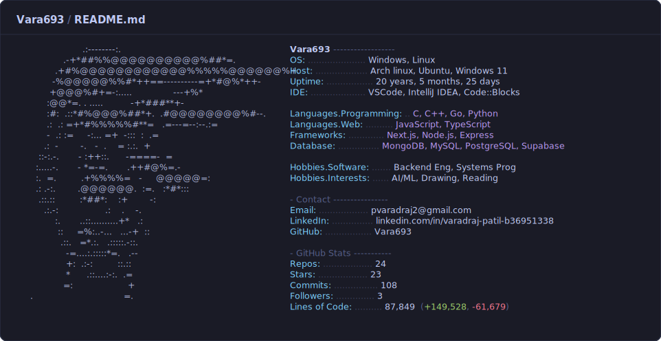

<!--
  This README pulls in dark_mode.svg / light_mode.svg, which are
  auto-updated by .github/workflows/main.yml running main.py.

  ONE-TIME SETUP:
  1. Repo name must exactly match your GitHub username (e.g. "yourusername/yourusername").
  2. Put dark_mode.svg, light_mode.svg, main.py, and this README.md in the repo root.
  3. Put main.yml in .github/workflows/main.yml
  4. Add an empty file at cache/.gitkeep so the cache/ folder exists.
  5. Create a fine-grained PAT (see comment at the top of main.py) and add two
     repo secrets: ACCESS_TOKEN (the token) and USER_NAME (your GitHub username).
  6. Edit BIRTHDAY near the top of main.py.
  7. Open the Actions tab and run "Update README stats" once manually
     (workflow_dispatch) to generate real numbers immediately.
  8. Fill in the remaining [PLACEHOLDER] fields directly inside dark_mode.svg
     and light_mode.svg (OS, Host, IDE, Languages, Contact, etc.) — those
     aren't pulled from the GitHub API, only the "GitHub Stats" section is.
-->

<picture>
  <source media="(prefers-color-scheme: dark)" srcset="./dark_mode.svg">
  <source media="(prefers-color-scheme: light)" srcset="./light_mode.svg">
  
</picture>
